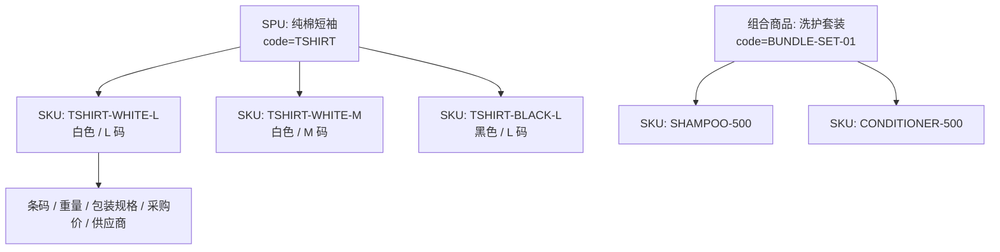
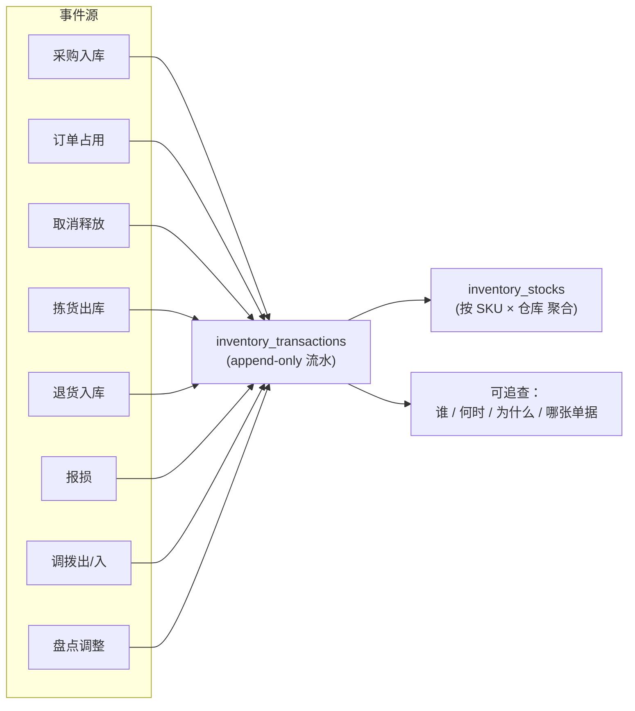
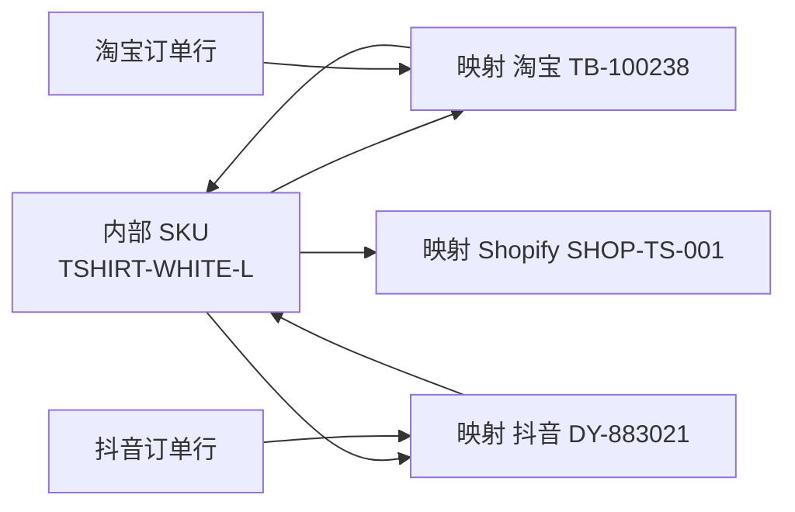
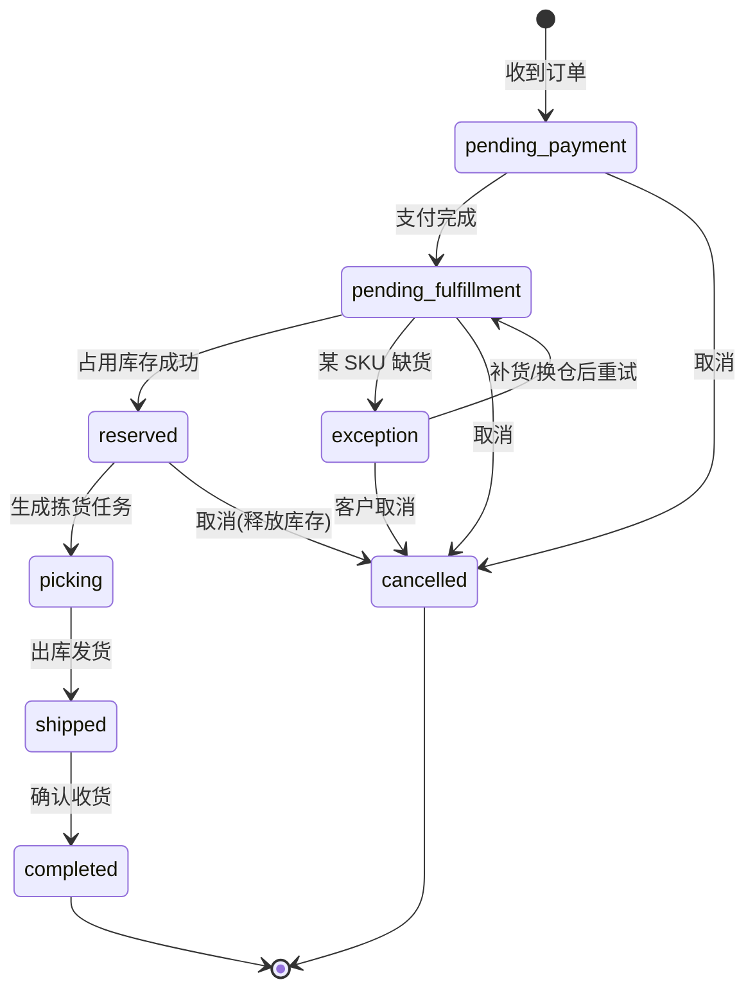
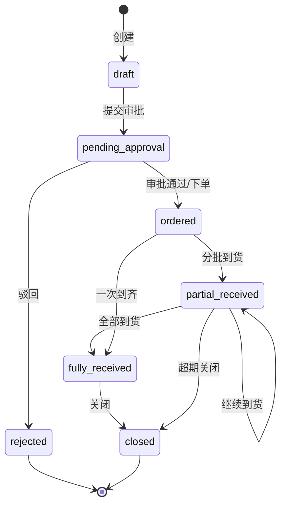
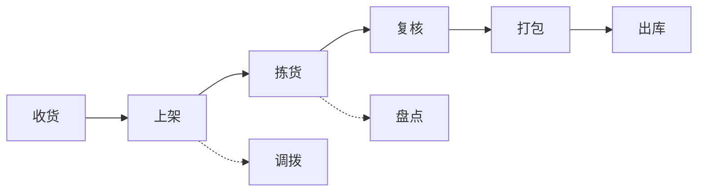
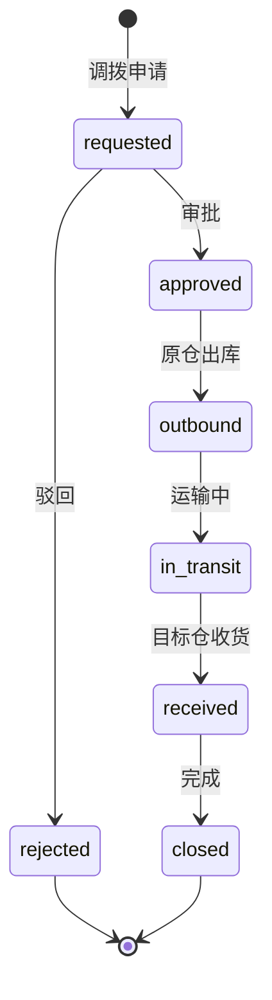
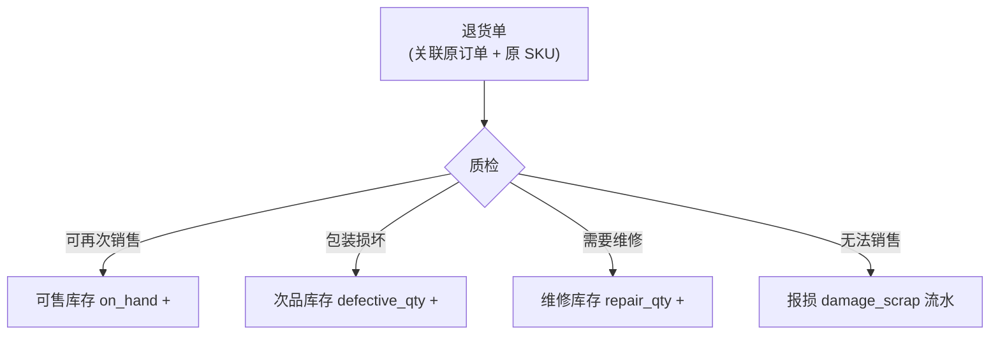
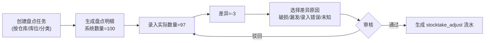
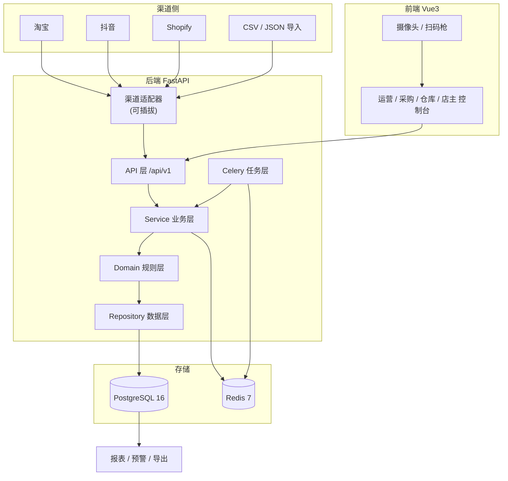

# 多渠道电商库存与采购协同平台 · 项目文档

| 项目代号 | **OmniStock** |
| --- | --- |
| 中文名 | 多渠道电商库存与采购协同平台 |
| 文档版本 | v1.0（立项 + 迭代规划） |
| 仓库定位 | **公开仓库**（GitHub Public，MIT License） |
| 部署形态 | Docker Compose 单机私有化，可平滑上云 |
| 目标场景 | 多平台卖货、多仓发货的中小电商团队（3–30 人） |
| 技术栈 | FastAPI + PostgreSQL 16 + Redis 7 + Vue 3 + TypeScript |
| 迭代数量 | **8 个连续功能迭代（里程碑 M1–M8）** |
| 规划体量 | 代码文件 **160+**（不含 `.md`）、提交 **47+**、代码约 **2.1 万行** |

---

## 目录

1. [项目简介](#1-项目简介)
2. [角色与权限](#2-角色与权限)
3. [核心业务模型](#3-核心业务模型)
4. [主要业务流程](#4-主要业务流程)
5. [技术架构](#5-技术架构)
6. [数据库设计](#6-数据库设计)
7. [迭代里程碑 M1–M8](#7-迭代里程碑)
8. [报表与预警](#8-报表与预警)
9. [工程亮点与难点](#9-工程亮点与难点)
10. [仓库目录结构](#10-仓库目录结构)
11. [快速开始](#11-快速开始)
12. [迭代体量核算](#12-迭代体量核算)
13. [验收约束对照](#13-验收约束对照)
14. [安全与数据规范](#14-安全与数据规范)
15. [路线图](#15-路线图)
16. [贡献指南与许可](#16-贡献指南与许可)

---

## 1. 项目简介

### 1.1 背景：小团队卖货的真实困境

一个典型的 5 人电商小团队，同时在淘宝、抖音、Shopify 三个平台卖货，货放在总仓、直播间仓和退货仓三个地方，日常会遇到这些情况：

- **多平台库存对不上**：三个平台的商品编码各不相同，同一个实物商品在不同后台是三个不同的数字，库存靠手动改，改慢一步就超卖。
- **超卖与缺货同时发生**：A 平台卖爆了，B 平台的同一件货还在挂着卖；等 B 平台出单时才发现没货，只能赔付、道歉、退款。
- **采购拍脑袋**：什么时候补货、补多少，全凭"感觉快没了"，要么断货丢单，要么压一大批滞销库存占资金。
- **退货后库存不准**：客户退回来的货是好的、坏的、缺件的，混在一起随手入账，结果系统里写着有货，实际发不出去。
- **盘点是场灾难**：季度盘一次，系统数和实物数对不上，差异原因查不出来，最后只能"调平了事"，谁的责任说不清。
- **出了问题查不到**：某天发现某个 SKU 少了 12 件，谁改的、什么时候改的、因为什么改的——没有任何记录。

这些问题的共同根源只有一个：**库存被当成一个可以随便改的数字，而不是一笔笔有来源、有去向的流水。**

### 1.2 项目目标

构建一套围绕**真实电商业务**设计的库存与采购协同平台，做到：

| 目标 | 可验证的落地形式 |
| --- | --- |
| 商品分层统一管理 | SPU / SKU / 组合商品三层模型 + 条码 + 供应商 + 采购价 |
| 多平台商品归一 | 渠道商品映射表，外部编码统一落到内部 SKU |
| 库存口径清晰 | 实际 / 已占用 / 可售 / 在途 / 安全 五个口径 + 可售公式 |
| 库存变化可追溯 | **库存流水（append-only ledger）**，所有变动写明来源单据 |
| 订单不超卖 | 渠道适配器同步 + 幂等去重 + 并发占用 + 缺货异常单 |
| 采购有计划 | 库存预警 + 补货建议公式 + 采购单全流程 + 分批收货质检 |
| 多仓可流转 | 调拨申请 → 审批 → 原仓出库 → 运输中 → 目标仓收货 |
| 退货有序 | 质检分流：可售 / 次品 / 维修 / 报损 |
| 盘点有据 | 系统数 vs 实数、差异原因、审核后生成调整流水 |
| 经营可分析 | 周转天数、供应商及时率、渠道对比、缺货次数、退货率等报表 |

### 1.3 设计原则

1. **库存永远不能"直接改数字"**。任何库存变化都必须产生一条 `inventory_transactions` 流水，且流水只增不改（append-only）。聚合表 `inventory_stocks` 是流水的物化结果。
2. **产品围绕真实电商业务设计**。不是通用仓库 Demo，而是能跑通"多平台出单 → 占库存 → 拣货 → 发货 → 缺货 → 补货 → 收货 → 退货 → 盘点"的完整闭环。
3. **每个里程碑都有外部行为变化**：新增 API、页面、配置项、错误码或产出文件，用户能直接看到或调用到新东西。
4. **每个里程碑围绕一个完整需求**，数据库、后端、前端、后台任务、权限、错误处理、测试一起完成，不夹带无关重构。
5. **不整段复制开源项目**：只使用通用框架与库（FastAPI、SQLAlchemy、Vue、Element Plus、Celery 等），业务逻辑（库存占用算法、组合拆分、调拨在途、退货分流、盘点差异审核）全部自研。

### 1.4 为什么它不是"普通库存 CRUD"

普通库存 CRUD 只有一张表、加加减减。本项目的复杂度来自**真实电商的并发与状态**：

- 多渠道订单**同时**下单，抢同一批库存，需要**先到先得**且**不超卖**（并发）；
- 同一订单被渠道**重复推送**，不能重复扣库存（幂等）；
- 组合商品（套装）要**拆解**成实际库存 SKU（爆炸拆分）；
- 采购在途、调拨在途的库存**不能算可售**（口径）；
- 退货要**质检分流**到不同库存状态（状态机）；
- 盘点差异要**审核后**才能生成调整（审批 + 审计）。

---

## 2. 角色与权限

系统包含四类业务角色 + 一个超级管理员，采用 **RBAC（用户 – 角色 – 权限）** 模型，一个用户可拥有多个角色。

| 角色 | 标识 | 核心权限 |
| --- | --- | --- |
| 店主 / 管理员 | `owner` | 查看整体经营报表、配置仓库与库位、管理用户与角色、审批规则、审计日志 |
| 运营人员 | `operator` | 商品 / SKU / 组合商品维护、渠道商品映射、同步订单、处理缺货与售后 |
| 采购人员 | `buyer` | 供应商管理、创建采购单、跟踪到货、收货质检、查看补货建议 |
| 仓库人员 | `warehouse` | 收货、上架、拣货、复核、打包、出库、盘点、调拨 |
| 系统管理员 | `admin` | 全局权限、系统配置、通知通道、渠道适配器配置、运维 |

### 2.1 核心用例

```
店主      → 登录 → 看经营看板 → 配置仓库/库位 → 分配角色 → 调整审批阈值 → 查审计日志
运营      → 建 SPU/SKU → 绑多渠道商品 → 同步/导入订单 → 处理异常订单 → 处理售后
采购      → 看补货建议 → 选供应商 → 建采购单 → 催货 → 分批收货 → 记录质检结果
仓库      → 收货上架 → 接拣货任务(按库位排序) → 扫码拣货 → 复核 → 打包 → 出库
仓库      → 发起调拨 → 原仓出库 → 目标仓收货 → 发起盘点 → 录差异 → 提交审核
```

### 2.2 不在范围内（明确排除）

- 不做多租户 SaaS 与租户计费；
- 不做面向 C 端的商城前台（本项目是**中后台**，订单从渠道同步或导入）；
- 不做真实支付清结算（只记录订单金额与采购金额）；
- 不接真实快递面单打印硬件（预留面单模板与导出，不接打印机驱动）；
- 渠道适配器**优先支持 CSV / JSON 导入**，真实平台 API 以可插拔适配器形式预留（M8）。

---

## 3. 核心业务模型

### 3.1 商品的三层结构

| 层次 | 说明 | 示例 |
| --- | --- | --- |
| **SPU**（标准产品单元） | 聚合层，描述"卖的是什么" | 纯棉短袖 |
| **SKU**（最小库存单元） | 实际管理库存与价格的单元 | 白色 / L 码 |
| **组合商品**（Bundle） | 由多个 SKU 打包出售 | 洗发水 + 护发素套装 |



> 组合商品在**下单时**拆解为实际库存 SKU，占用的是被拆分 SKU 的库存；组合商品自身不持有库存。

### 3.2 SKU 的库存口径

每个 SKU 在**每个仓库**上都有一组库存口径，绝不只存一个数字：

| 口径 | 字段 | 含义 |
| --- | --- | --- |
| 实际库存 | `on_hand_qty` | 仓库里物理存在的数量 |
| 已占用库存 | `reserved_qty` | 已被未发货订单锁定 |
| 可售库存 | `available_qty`（计算值） | 能继续卖的数量 |
| 在途库存 | `in_transit_qty` | 采购 / 调拨在路上，尚未入库 |
| 安全库存 | `safety_qty` | 低于它就该补货的缓冲 |
| 次品库存 | `defective_qty` | 质检后不可当正品卖 |
| 维修库存 | `repair_qty` | 待维修/维修中 |

**核心公式：**

```
可售库存 = 实际库存 - 已占用库存 - 安全库存
```

> `available_qty` 不落库为独立可写字段，而是由 `on_hand_qty / reserved_qty / safety_qty` 实时计算（或由物化视图/生成列维护），避免"三个数字各改各的"导致不自洽。

### 3.3 库存流水（Ledger）：一切变化的唯一真相

库存不通过 `UPDATE` 任意数字变更，而是通过**库存流水**记录每一次变化：



流水字段要素：`sku_id`、`warehouse_id`、`location_id`、`type`、`qty_delta`、`on_hand_before/after`、`reserved_before/after`、`ref_type`（来源单据类型）、`ref_id`（来源单据 ID）、`operator_id`、`remark`、`idempotency_key`、`created_at`。

流水类型 `type` 枚举：

```
purchase_inbound      采购入库
order_reserve         订单占用
order_release         订单取消释放
order_outbound        拣货出库
return_inbound        退货入库
return_defective      退货次品入库
return_repair         退货维修入库
damage_scrap          报损
transfer_out          调拨出库
transfer_in           调拨入库
stocktake_adjust      盘点调整
manual_adjust         手工调整（需审批 + 原因）
```

---

## 4. 主要业务流程

### 4.1 商品与渠道管理

运营创建 SPU 与 SKU，配置价格、图片、条码、重量、包装规格、供应商与采购价。同一个内部 SKU 可绑定多个渠道商品：

```
内部 SKU：TSHIRT-WHITE-L
  ├── 淘宝商品：TB-100238
  ├── 抖音商品：DY-883021
  └── Shopify 商品：SHOP-TS-001
```



不同平台编码不一致，通过 `channel_products` 映射表统一落到同一个内部 SKU 的库存上。

### 4.2 电商订单同步

订单从渠道适配器进入系统（优先 CSV / JSON 导入，适配器可插拔）。**订单状态机：**



**关键规则：**

| 规则 | 实现要点 |
| --- | --- |
| 重复同步不重复扣库存 | `channel_id + channel_order_no` 唯一约束 + 幂等键；重复消息直接返回首次结果 |
| 取消订单自动释放库存 | 状态转 `cancelled` 时生成 `order_release` 流水 |
| 某 SKU 缺货进异常单 | 占用时任一 SKU 可售不足 → 整单转 `exception`，不部分占用 |
| 组合商品拆解 | 下单时按 `bundle_items` 展开为实际 SKU 需求，再逐个占用 |
| 多平台并发先到先得 | 行级锁 `SELECT ... FOR UPDATE` + 事务，保证不超卖 |

### 4.3 采购与入库

根据库存预警生成采购建议：

```
建议采购量 = 预测销量 + 安全库存 - 当前可售库存 - 在途库存
```

采购单状态机：



**采购人员操作流程：** 查低库存 SKU → 选供应商 → 建采购单 → 记预计到货 → 分批收货 → 记短收/破损/质检 → 合格品入库。

> 每次收货都产生**入库单**与**库存流水**，不允许直接改库存数字。

### 4.4 仓库作业

仓库人员用条码扫描完成全流程：



- 拣货任务按**库位排序**（`location_code` 升序），减少走动距离；
- 扫描到错误 SKU：**立即报错并阻止继续**，不允许"跳过"；
- 未接真实扫码枪时，用浏览器摄像头（`html5-qrcode`）或手动输入条码模拟。

### 4.5 多仓库与调拨

支持总仓、直播间仓、退货仓等。调拨流程：



调拨过程中三个口径必须分清：

| 阶段 | 原仓 | 在途 | 目标仓 |
| --- | --- | --- | --- |
| 原仓出库后 | `on_hand` 减少 | `in_transit` 增加 | 不变 |
| 目标仓收货前 | 不变 | 保持 | **不可售** |
| 目标仓收货后 | 不变 | 减少 | `on_hand` 增加，**变为可售** |

> 目的：**调拨还没到货，不能提前显示为可售库存。**

### 4.6 售后与退货

退货商品必须经过质检分流：



退货单关联**原始订单**与**原始 SKU**，防止退错商品或重复入库（校验退货数量 ≤ 已售数量 - 已退数量）。

### 4.7 库存盘点与差异



差异必须**审核后**才能生成调整流水，并保留操作人员、时间、原因。

### 4.8 报表与预警

见 [第 8 章](#8-报表与预警)。

---

## 5. 技术架构

### 5.1 技术选型

| 层次 | 选型 | 说明 |
| --- | --- | --- |
| 后端框架 | FastAPI 0.115 / Python 3.12 | 自带 OpenAPI，接口即文档 |
| ORM / 迁移 | SQLAlchemy 2.0 + Alembic | 每轮迭代一条迁移，便于界定改动范围 |
| 数据库 | PostgreSQL 16（测试用 SQLite） | 行级锁 + 唯一约束 + JSONB，适合并发库存 |
| 缓存 / 队列 | Redis 7 + Celery | 库存热点缓存、异步任务、定时扫描 |
| 定时任务 | Celery Beat | 预警扫描、超期订单、在途超时、报表快照 |
| 前端 | Vue 3 + TypeScript + Vite + Pinia + Vue Router | 组合式 API，类型完备 |
| UI / 图表 | Element Plus + ECharts | 表格、看板、趋势图 |
| 条码 | html5-qrcode（浏览器摄像头） | 无扫码枪时可用，兼容真实扫码枪键盘输入 |
| 鉴权 | JWT（access + refresh）+ RBAC | `access 30min / refresh 7d`，可配置 |
| 测试 | pytest + httpx（后端）、Vitest + Playwright（前端） | 每轮附对应测试 |
| 部署 | Docker Compose + Nginx | 单机一条 `make up` 起服务 |

### 5.2 分层结构

```
API 层（routers）      → 参数校验、鉴权、序列化
Service 层（services） → 业务规则：库存占用、组合拆分、状态机、调拨在途、预警
Domain 层（domain）    → 纯逻辑：可售计算、补货公式、拣货排序
Repository 层          → 数据访问封装（含 FOR UPDATE 加锁）
Model 层（models）     → SQLAlchemy ORM
Task 层（tasks）       → Celery 异步 / 定时任务
```

### 5.3 系统架构图



### 5.4 并发与幂等设计（工程重点）

库存占用是本项目最容易出错的点。设计如下：

| 问题 | 方案 |
| --- | --- |
| 并发超卖 | 占用时对 `inventory_stocks` 行加 `SELECT ... FOR UPDATE`，事务内校验可售，不足则回滚整单 |
| 高并发热点 | Redis 预扣 + 数据库最终一致（可选优化，默认走数据库强一致） |
| 重复同步扣两次 | `(channel_id, channel_order_no)` 唯一索引 + `Idempotency-Key`，重复请求返回首次结果 |
| 重复消息/重放 | 入库前查 `order_sync_logs`，已处理的直接短路 |
| 调拨重复收货 | `transfer_receipts` 唯一约束 + 收货幂等键 |
| 乐观并发 | 库存表带 `version` 字段，冲突时抛 `40903` 由上层重试 |

**占用库存伪代码：**

```python
def reserve(order: SalesOrder):
    with tx():
        for item in expand_bundles(order.items):      # 组合拆解
            stock = inventory_repo.lock_for_update(
                sku_id=item.sku_id, warehouse_id=item.warehouse_id
            )                                          # 行级锁，先到先得
            if stock.available < item.qty:             # 可售 = 实际 - 已占 - 安全
                raise InsufficientStock(item.sku_id)   # 整单失败 → 异常单
            stock.reserved_qty += item.qty
            ledger.append(type="order_reserve", ref=order, item=item)
```

---

## 6. 数据库设计

共 **45+ 张表**，按里程碑引入（每条 Alembic 迁移与里程碑一一对应）：

| 里程碑 | 主要表 |
| --- | --- |
| M1 | `users`、`roles`、`permissions`、`user_roles`、`role_permissions`、`refresh_tokens`、`warehouses`、`warehouse_locations`、`spus`、`skus`、`sku_barcodes`、`bundle_items`、`inventory_stocks`、`inventory_transactions` |
| M2 | `channels`、`channel_shops`、`channel_products`、`sales_orders`、`sales_order_items`、`order_sync_logs`、`order_exceptions`、`import_batches` |
| M3 | `pick_tasks`、`pick_task_items`、`scan_logs`、`package_records`、`shipments` |
| M4 | `suppliers`、`supplier_skus`、`purchase_orders`、`purchase_order_items`、`goods_receipts`、`goods_receipt_items`、`qc_records` |
| M5 | `transfers`、`transfer_items`、`transfer_events` |
| M6 | `stock_alert_rules`、`stock_alerts`、`replenishment_suggestions`、`sales_forecasts`、`notifications`、`notification_deliveries` |
| M7 | `return_orders`、`return_order_items`、`qc_inspections`、`stocktake_tasks`、`stocktake_items`、`stocktake_adjustments` |
| M8 | `report_snapshots`、`export_jobs`、`channel_adapter_configs`、`audit_logs`、`system_settings` |

### 6.1 核心表字段（节选）

**skus（SKU）**

| 字段 | 类型 | 说明 |
| --- | --- | --- |
| id | bigint PK | |
| spu_id | FK | 所属 SPU |
| sku_code | varchar(64) unique | 内部编码 `TSHIRT-WHITE-L` |
| spec_json | jsonb | 规格 `{"color":"白","size":"L"}` |
| barcode | varchar(64) | 条形码 / 二维码 |
| weight_g | int | 重量（克），用于运费/面单 |
| package_spec | varchar(128) | 包装规格 |
| purchase_price_cents | int | 采购价（分） |
| default_supplier_id | FK null | 默认供应商 |
| status | enum | `active / archived` |

**inventory_stocks（SKU × 仓库 聚合库存）**

| 字段 | 类型 | 说明 |
| --- | --- | --- |
| id | bigint PK | |
| sku_id | FK | |
| warehouse_id | FK | |
| on_hand_qty | int | 实际库存 |
| reserved_qty | int | 已占用 |
| in_transit_qty | int | 在途（采购 + 调拨） |
| safety_qty | int | 安全库存 |
| defective_qty | int | 次品 |
| repair_qty | int | 维修 |
| version | int | 乐观锁版本 |
| updated_at | timestamptz | |

> `UNIQUE(sku_id, warehouse_id)`；可售库存 = `on_hand_qty - reserved_qty - safety_qty`。

**inventory_transactions（库存流水，append-only）**

| 字段 | 类型 | 说明 |
| --- | --- | --- |
| id | bigint PK | |
| sku_id / warehouse_id / location_id | FK | 定位 |
| type | enum | 12 种流水类型（见 3.3） |
| qty_delta | int | 变化量（+/-） |
| on_hand_before / on_hand_after | int | 变更前后实际库存 |
| reserved_before / reserved_after | int | 变更前后占用 |
| ref_type / ref_id | varchar / bigint | 来源单据 |
| operator_id | FK | 操作人 |
| idempotency_key | varchar(64) | 幂等键，唯一 |
| remark | varchar(255) | 备注 / 差异原因 |
| created_at | timestamptz | |

**sales_orders（电商订单）**

| 字段 | 类型 | 说明 |
| --- | --- | --- |
| id | bigint PK | |
| channel_id / shop_id | FK | 来源渠道 / 店铺 |
| channel_order_no | varchar(64) | 渠道订单号 |
| status | enum | `pending_payment / pending_fulfillment / reserved / picking / shipped / completed / cancelled / exception` |
| warehouse_id | FK | 发货仓 |
| buyer_nick | varchar(64) | 买家昵称（脱敏） |
| total_amount_cents | int | 订单金额（分） |
| is_bundle | bool | 是否含组合商品 |
| idempotency_key | varchar(64) | 幂等键 |

> `UNIQUE(channel_id, channel_order_no)` —— 重复同步的**数据库层兜底**。

---

## 7. 迭代里程碑

> 每个里程碑围绕一个完整需求，从数据库、后端接口、前端页面、后台任务、权限、错误处理到测试一起完成。里程碑顺序即迭代轮次顺序，共 **8 个**。

| 里程碑 | 主题 | 外部行为变化（用户可见） |
| --- | --- | --- |
| **M1** | 商品与库存基础 | 可创建商品并查看库存变化（含流水） |
| **M2** | 电商订单处理 | 导入订单后库存自动被占用 |
| **M3** | 仓库发货 | 仓库人员可完成一条订单的发货 |
| **M4** | 采购与收货 | 采购单到货后库存与采购状态同步变化 |
| **M5** | 多仓库调拨 | 商品可在多个仓库之间流转 |
| **M6** | 库存预警 | 系统自动生成低库存采购建议 |
| **M7** | 退货与盘点 | 退货和盘点生成可追溯的库存调整 |
| **M8** | 报表与渠道适配 | 管理员可分析销售、库存与采购表现 |

---

### M1 · 商品与库存基础

**需求范围**：SPU / SKU / 组合商品三层模型、仓库与库位、库存五口径与库存流水、RBAC 权限、手工库存调整（需原因）。

**外部行为变化**

| 类别 | 内容 |
| --- | --- |
| 新增 API | `POST /api/v1/auth/login`、`POST /api/v1/auth/refresh`、`GET/POST /api/v1/users`、`GET/POST /api/v1/warehouses`、`GET/POST /api/v1/warehouses/{id}/locations`、`GET/POST /api/v1/spus`、`GET/POST /api/v1/skus`、`GET/PATCH /api/v1/skus/{id}`、`POST /api/v1/skus/{id}/barcodes`、`GET/POST /api/v1/bundles`、`GET /api/v1/inventory`、`GET /api/v1/inventory/ledger`、`POST /api/v1/inventory/adjust` |
| 新增页面 | 登录页、商品（SPU）列表页、SKU 详情页（含库存卡片 + 流水时间线）、库存总览页、仓库与库位管理页、组合商品配置页 |
| 新增配置项 | `AUTH_ACCESS_TTL_MINUTES`、`AUTH_REFRESH_TTL_DAYS`、`SKU_CODE_PREFIX`、`DEFAULT_WAREHOUSE_CODE`、`INVENTORY_ALLOW_NEGATIVE`、`CURRENCY` |
| 新增错误码 | `40101 AUTH_INVALID_CREDENTIALS`、`40102 AUTH_TOKEN_EXPIRED`、`40103 AUTH_ACCOUNT_LOCKED`、`40301 PERMISSION_DENIED`、`40901 SPU_CODE_DUPLICATE`、`40902 SKU_CODE_DUPLICATE`、`40903 BARCODE_DUPLICATE`、`40904 INVENTORY_CONCURRENT_CONFLICT`、`40905 ADJUST_REASON_REQUIRED`、`40906 INSUFFICIENT_STOCK`、`40907 BUNDLE_COMPONENT_INVALID`、`40908 WAREHOUSE_CODE_DUPLICATE`、`40909 LOCATION_CODE_DUPLICATE`、`40010 INVENTORY_ADJUST_ZERO_DELTA`、`40011 BUNDLE_CANNOT_NEST`、`40013 SPU_TYPE_NOT_BUNDLE` |
| 产出文件 | `alembic/versions/0001_init_product_inventory.py`、种子脚本 `scripts/seed.py`、OpenAPI schema |

**改动文件清单（40 个）**

```
backend/app/main.py
backend/app/core/config.py
backend/app/core/security.py
backend/app/core/errors.py
backend/app/core/deps.py
backend/app/db/session.py
backend/app/models/user.py
backend/app/models/role.py
backend/app/models/warehouse.py
backend/app/models/product.py
backend/app/models/inventory.py
backend/app/schemas/auth.py
backend/app/schemas/user.py
backend/app/schemas/warehouse.py
backend/app/schemas/product.py
backend/app/schemas/inventory.py
backend/app/repositories/user_repo.py
backend/app/repositories/product_repo.py
backend/app/repositories/inventory_repo.py
backend/app/services/auth_service.py
backend/app/services/permission_service.py
backend/app/services/product_service.py
backend/app/services/inventory_service.py
backend/app/services/combo_service.py
backend/app/domain/stock_formula.py
backend/app/api/v1/auth.py
backend/app/api/v1/users.py
backend/app/api/v1/warehouses.py
backend/app/api/v1/products.py
backend/app/api/v1/inventory.py
backend/alembic/versions/0001_init_product_inventory.py
backend/tests/test_auth.py
backend/tests/test_product_sku.py
backend/tests/test_inventory_ledger.py
backend/tests/test_combo_split.py
web/src/views/Login.vue
web/src/views/ProductList.vue
web/src/views/SkuDetail.vue
web/src/views/InventoryList.vue
web/src/components/InventoryLedgerTable.vue
web/src/stores/auth.ts
```

**体量**：约 **3,050 行**（后端 ~2,250 / 前端 ~800）

**验收标准**

1. `member` 之外的越权操作返回 `40301`；错误密码登录返回 `40101`。
2. 重复 `sku_code` 创建返回 `40901`；重复 `barcode` 返回 `40902`。
3. 任一库存变动后，`GET /api/v1/inventory/ledger?sku_id=` 能查到对应流水，且 `on_hand_before + qty_delta = on_hand_after`。
4. 手工调整库存不填原因返回 `40905`。
5. 组合商品拆解：1 个套装（洗发水 ×1 + 护发素 ×1）下单占用后，两个子 SKU 的 `reserved_qty` 各 +1。
6. 并发 20 个请求占用同一 SKU 的 10 件库存，成功占用总量恰为 10，无超卖。

**提交区间**：`feat(m1): backend skeleton and auth`（实际为 `chore: 初始化仓库骨架与部署配置`）→ `docs(m1): 项目文档`（共 10 次提交）

### M1 实施记录（v0.1.0）

实际落地与规划有几处偏差，以交付代码为准：

| 项 | 规划 | 实际 |
| --- | --- | --- |
| 提交数 | 7 | **10** |
| 代码文件（不含 `.md`） | 40 | **100** |
| 数据表 | 14 | **14** ✅ |
| 测试用例 | — | **53，全部通过** |
| 错误码 | 6 个 | **16 个**（编号见上表行） |
| 额外新增 | — | `app/seed.py` 演示种子数据、`api/v1/guards.py` 角色守卫、`domain/bundle_math.py` |

**并发防超卖的实现方式（值得记录的坑）**：最初按常见写法「先 `SELECT` 判可售、再 `UPDATE` 扣减」，在 SQLite 上并发测试直接暴露了丢失更新——20 个请求全部成功，超卖了 10 件。最终改为**条件 UPDATE（compare-and-set）**：把「可售 ≥ 请求量」写进 `WHERE` 子句，由数据库在持有行写锁时重新求值，再 `session.refresh()` 取回前后值写入流水。这样在 SQLite 和 PostgreSQL 上都成立，不依赖 `SELECT ... FOR UPDATE` 的方言差异。

---

### M2 · 电商订单处理

**需求范围**：渠道与店铺配置、渠道商品映射、订单 CSV/JSON 导入、订单状态机、库存占用与取消释放、幂等去重、异常订单。

**外部行为变化**

| 类别 | 内容 |
| --- | --- |
| 新增 API | `GET/POST /api/v1/channels`、`GET/POST /api/v1/channel-shops`、`GET/POST /api/v1/channel-products`、`POST /api/v1/orders/import`（CSV/JSON）、`GET /api/v1/orders`、`GET /api/v1/orders/{id}`、`POST /api/v1/orders/{id}/cancel`、`GET /api/v1/orders/exceptions`、`POST /api/v1/orders/{id}/retry-reserve`、`GET /api/v1/order-sync-logs` |
| 新增页面 | 渠道与店铺配置页、渠道商品映射页、订单导入页（上传 CSV/JSON + 预览 + 错误行提示）、订单列表页、订单详情页、异常订单页 |
| 新增配置项 | `ORDER_SYNC_BATCH_SIZE`、`ORDER_IDEMPOTENT_WINDOW_HOURS`、`ORDER_SHORTAGE_STRATEGY`（`exception`/`partial`）、`IMPORT_MAX_ROWS`、`IMPORT_ENCODING` |
| 新增错误码 | `40910 ORDER_DUPLICATE_SYNC`、`40911 ORDER_STOCK_SHORTAGE`、`40912 ORDER_STATUS_INVALID_TRANSITION`、`40010 CHANNEL_MAPPING_NOT_FOUND`、`42201 IMPORT_PARSE_ERROR` |
| 产出文件 | `alembic/versions/0002_order_channel.py`、导出/导入模板 `docs/order-import-template.csv` |

**核心表**：`channels`、`channel_shops`、`channel_products`、`sales_orders`、`sales_order_items`、`order_sync_logs`、`order_exceptions`、`import_batches`

**改动文件清单（24 个）**

```
backend/app/models/channel.py
backend/app/models/order.py
backend/app/schemas/channel.py
backend/app/schemas/order.py
backend/app/repositories/channel_repo.py
backend/app/repositories/order_repo.py
backend/app/services/channel_service.py
backend/app/services/order_service.py
backend/app/services/order_reserve_service.py
backend/app/services/order_import_service.py
backend/app/adapters/base.py
backend/app/adapters/csv_adapter.py
backend/app/adapters/json_adapter.py
backend/app/api/v1/channels.py
backend/app/api/v1/channel_products.py
backend/app/api/v1/orders.py
backend/app/api/v1/order_import.py
backend/alembic/versions/0002_order_channel.py
backend/tests/test_order_idempotency.py
backend/tests/test_order_reserve_concurrency.py
backend/tests/test_order_exception.py
backend/tests/test_order_import_csv.py
web/src/views/OrderList.vue
web/src/views/OrderImport.vue
```

**体量**：约 **2,860 行**

**验收标准**

1. 同一 `(channel_id, channel_order_no)` 导入两次，库存只被占用一次，第二次返回 `40910` 且不新增流水。
2. 订单占用时某 SKU 可售不足，整单转 `exception` 且**不发生部分占用**。
3. 取消已占用订单后，`reserved_qty` 回落，生成 `order_release` 流水。
4. 组合商品订单占用时按 `bundle_items` 拆解到实际 SKU。
5. CSV 导入含错误行时返回 `42201` 并给出行号；超过 `IMPORT_MAX_ROWS` 直接拒绝。
6. 并发 30 个订单抢 10 件库存，占用成功总量 ≤ 10，其余进异常单。

**提交区间**：`feat(m2): channel model and product mapping` → `feat(m2): order import with idempotency and exception flow`（共 6 次提交）

---

### M3 · 仓库发货

**需求范围**：拣货任务生成与库位排序、条码扫描拣货、复核、打包、出库发货、次品标记。

**外部行为变化**

| 类别 | 内容 |
| --- | --- |
| 新增 API | `GET /api/v1/pick-tasks`、`POST /api/v1/pick-tasks/generate`、`POST /api/v1/pick-tasks/{id}/scan`、`POST /api/v1/pick-tasks/{id}/confirm`、`POST /api/v1/pick-tasks/{id}/review`、`POST /api/v1/pick-tasks/{id}/pack`、`POST /api/v1/pick-tasks/{id}/ship` |
| 新增页面 | 拣货工作台（库位排序 + 扫码）、复核页、打包页、发货确认页、扫码组件（摄像头/扫码枪双模式） |
| 新增配置项 | `PICK_SORT_STRATEGY`（`location`/`sku`）、`SCAN_MODE`（`camera`/`gun`/`manual`）、`PACKAGE_LABEL_TEMPLATE`、`SHIPMENT_CARRIER_DEFAULT` |
| 新增错误码 | `40920 PICK_TASK_NOT_FOUND`、`40921 PICK_SCAN_MISMATCH`、`40922 PICK_TASK_ALREADY_SHIPPED`、`40923 PICK_QTY_MISMATCH` |
| 产出文件 | `alembic/versions/0003_picking_shipping.py`、面单模板 `docs/package-label.html` |
| 后台任务 | `tasks/order_timeout_watchdog.py`：占用超时未发货自动释放（可配置） |

**拣货状态机**：`created → picking → picked → reviewed → packed → shipped`

**改动文件清单（21 个）**

```
backend/app/models/picking.py
backend/app/models/shipment.py
backend/app/schemas/picking.py
backend/app/repositories/picking_repo.py
backend/app/services/picking_service.py
backend/app/services/scan_service.py
backend/app/services/shipping_service.py
backend/app/domain/pick_sorter.py
backend/app/api/v1/pick_tasks.py
backend/app/api/v1/shipments.py
backend/app/tasks/order_timeout_watchdog.py
backend/alembic/versions/0003_picking_shipping.py
backend/tests/test_pick_sort.py
backend/tests/test_scan_mismatch.py
backend/tests/test_ship_flow.py
web/src/views/PickWorkbench.vue
web/src/views/ReviewPage.vue
web/src/views/PackPage.vue
web/src/components/BarcodeScanner.vue
web/src/api/picking.ts
web/src/types/picking.ts
```

**体量**：约 **2,520 行**

**验收标准**

1. 拣货任务按库位编码升序返回，减少走动路径。
2. 扫描与任务 SKU 不一致返回 `40921`，操作被阻断且不计入已拣数量。
3. 拣货数量与订单数量不符返回 `40923`，不允许进入复核。
4. 出库后订单状态为 `shipped`，并生成 `order_outbound` 流水（`reserved_qty` 与 `on_hand_qty` 同步减少）。
5. 已发货任务再次发货返回 `40922`。
6. 占用超时任务可由定时任务释放并写流水。

**提交区间**：`feat(m3): pick task and location sorting` → `feat(m3): barcode scan, pack and ship`（共 6 次提交）

---

### M4 · 采购与收货

**需求范围**：供应商与供货关系、采购单状态机、分批收货、短收/破损/质检、合格品入库。

**外部行为变化**

| 类别 | 内容 |
| --- | --- |
| 新增 API | `GET/POST /api/v1/suppliers`、`GET/PATCH /api/v1/suppliers/{id}`、`POST /api/v1/purchase-orders`、`GET /api/v1/purchase-orders`、`POST /api/v1/purchase-orders/{id}/submit`、`POST /api/v1/purchase-orders/{id}/approve`、`POST /api/v1/purchase-orders/{id}/receipts`、`GET /api/v1/goods-receipts`、`POST /api/v1/goods-receipts/{id}/qc`、`POST /api/v1/goods-receipts/{id}/inbound` |
| 新增页面 | 供应商管理页、采购单列表/详情页、收货单页（分批收货录入）、质检录入页 |
| 新增配置项 | `PO_APPROVAL_THRESHOLD_CENTS`、`PO_AUTO_CLOSE_DAYS`、`QC_REQUIRED_CATEGORIES`、`RECEIPT_OVER_DELIVERY_TOLERANCE`、`SUPPLIER_DEFAULT_LEAD_TIME_DAYS` |
| 新增错误码 | `40930 PO_STATUS_INVALID_TRANSITION`、`40931 RECEIPT_QTY_EXCEEDED`、`40932 SUPPLIER_DISABLED`、`40020 QC_RESULT_REQUIRED`、`40303 PO_APPROVAL_REQUIRED` |
| 产出文件 | `alembic/versions/0004_purchase_receipt.py`、入库单与流水 |

**采购状态机**：`draft → pending_approval → ordered → partial_received → fully_received → closed`（+ `rejected`）

**改动文件清单（25 个）**

```
backend/app/models/supplier.py
backend/app/models/purchase.py
backend/app/models/receipt.py
backend/app/schemas/supplier.py
backend/app/schemas/purchase.py
backend/app/schemas/receipt.py
backend/app/repositories/supplier_repo.py
backend/app/repositories/purchase_repo.py
backend/app/repositories/receipt_repo.py
backend/app/services/supplier_service.py
backend/app/services/purchase_service.py
backend/app/services/receipt_service.py
backend/app/services/qc_service.py
backend/app/domain/po_state_machine.py
backend/app/api/v1/suppliers.py
backend/app/api/v1/purchase_orders.py
backend/app/api/v1/goods_receipts.py
backend/alembic/versions/0004_purchase_receipt.py
backend/tests/test_po_flow.py
backend/tests/test_partial_receipt.py
backend/tests/test_qc_inbound.py
backend/tests/test_po_approval_threshold.py
web/src/views/SupplierList.vue
web/src/views/PurchaseOrderList.vue
web/src/views/GoodsReceipt.vue
```

**体量**：约 **2,780 行**

**验收标准**

1. 采购金额 ≥ `PO_APPROVAL_THRESHOLD_CENTS` 提交后进入 `pending_approval`，未审批直接下单返回 `40303`。
2. 分批收货累计数量超过订单量（含 `RECEIPT_OVER_DELIVERY_TOLERANCE`）返回 `40931`。
3. 分两次收货后，采购单状态依次为 `partial_received → fully_received`。
4. 质检结果缺失时入库返回 `40020`；合格品入库生成 `purchase_inbound` 流水，`in_transit_qty` 减少、`on_hand_qty` 增加。
5. 禁用供应商下新采购单返回 `40932`。
6. 短收 / 破损数量在收货单中留痕，不污染正品入库数量。

**提交区间**：`feat(m4): supplier and purchase order workflow` → `feat(m4): partial receipt, qc and inbound`（共 6 次提交）

---

### M5 · 多仓库调拨

**需求范围**：调拨申请与审批、原仓出库、运输中在途、目标仓收货、调拨事件留痕。

**外部行为变化**

| 类别 | 内容 |
| --- | --- |
| 新增 API | `POST /api/v1/transfers`、`GET /api/v1/transfers`、`GET /api/v1/transfers/{id}`、`POST /api/v1/transfers/{id}/approve`、`POST /api/v1/transfers/{id}/outbound`、`POST /api/v1/transfers/{id}/receive`、`GET /api/v1/transfers/{id}/events` |
| 新增页面 | 调拨列表页、调拨详情页（流程时间线 + 三个口径对照）、发起调拨抽屉 |
| 新增配置项 | `TRANSFER_APPROVAL_REQUIRED`、`TRANSFER_IN_TRANSIT_TTL_HOURS`、`TRANSFER_ALLOW_PARTIAL_RECEIVE` |
| 新增错误码 | `40940 TRANSFER_STATUS_INVALID_TRANSITION`、`40941 TRANSFER_STOCK_SHORTAGE`、`40942 TRANSFER_DUPLICATE_RECEIVE` |
| 产出文件 | `alembic/versions/0005_transfer.py` |
| 后台任务 | `tasks/transfer_ttl_watchdog.py`：运输中超过 TTL 告警 |

**调拨状态机**：`requested → approved → outbound → in_transit → received → closed`（+ `rejected`）

**改动文件清单（19 个）**

```
backend/app/models/transfer.py
backend/app/schemas/transfer.py
backend/app/repositories/transfer_repo.py
backend/app/services/transfer_service.py
backend/app/services/transfer_transit_service.py
backend/app/domain/transfer_state_machine.py
backend/app/api/v1/transfers.py
backend/app/tasks/transfer_ttl_watchdog.py
backend/alembic/versions/0005_transfer.py
backend/tests/test_transfer_flow.py
backend/tests/test_transfer_transit.py
backend/tests/test_transfer_duplicate_receive.py
web/src/views/TransferList.vue
web/src/views/TransferDetail.vue
web/src/components/TransferTimeline.vue
web/src/components/CreateTransferDialog.vue
web/src/api/transfer.ts
web/src/stores/transfer.ts
web/src/types/transfer.ts
```

**体量**：约 **2,340 行**

**验收标准**

1. 原仓出库后，源仓 `on_hand` 减少、`in_transit` 增加，**目标仓可售不变**。
2. 处于 `in_transit` 的数量**不计入任一仓的可售库存**。
3. 目标仓收货后，目标仓 `on_hand` 增加且变为可售，`in_transit` 归零。
4. 重复收货返回 `40942`（幂等键兜底）。
5. 非法状态跳转（如 `requested → received`）返回 `40940`。
6. `GET /transfers/{id}/events` 可查到每一步操作人与时间。

**提交区间**：`feat(m5): transfer request and approval` → `feat(m5): transit inventory and destination receive`（共 5 次提交）

---

### M6 · 库存预警

**需求范围**：安全库存规则、低库存预警扫描、补货建议公式、销量预测、采购建议生成、站内/邮件/Webhook 通知。

**外部行为变化**

| 类别 | 内容 |
| --- | --- |
| 新增 API | `GET/PUT /api/v1/alert-rules`、`GET /api/v1/alerts`、`POST /api/v1/alerts/{id}/ack`、`GET /api/v1/replenishment-suggestions`、`POST /api/v1/replenishment-suggestions/{id}/to-purchase-order`、`GET /api/v1/notifications`、`POST /api/v1/notifications/{id}/read`、`GET/PUT /api/v1/notification-settings` |
| 新增页面 | 预警规则配置页、预警中心（未读红点）、补货建议页（一键转采购单）、通知中心 |
| 新增配置项 | `FORECAST_WINDOW_DAYS`、`REPLENISH_LEAD_TIME_DAYS`、`ALERT_SCAN_CRON`、`NOTIFY_CHANNELS`、`SMTP_HOST/PORT/USER/FROM`、`WEBHOOK_TIMEOUT_SECONDS`、`NOTIFY_MAX_RETRIES` |
| 新增错误码 | `40950 ALERT_RULE_DUPLICATE`、`42401 WEBHOOK_DELIVERY_FAILED`、`42402 EMAIL_NOT_CONFIGURED` |
| 产出文件 | `alembic/versions/0006_alert_notify.py`、`notify_worker` 命令行入口 |
| 后台任务 | `tasks/alert_scanner.py`（Beat 定时扫描）、`tasks/notify_worker.py`（指数退避重试 2/4/8/16s） |

**补货公式**：`建议采购量 = 预测销量 + 安全库存 - 当前可售库存 - 在途库存`

**改动文件清单（21 个）**

```
backend/app/models/alert.py
backend/app/models/notification.py
backend/app/schemas/alert.py
backend/app/schemas/notification.py
backend/app/repositories/alert_repo.py
backend/app/repositories/notification_repo.py
backend/app/services/alert_service.py
backend/app/services/replenish_service.py
backend/app/services/forecast_service.py
backend/app/services/notification_service.py
backend/app/services/channels/inapp.py
backend/app/services/channels/email.py
backend/app/services/channels/webhook.py
backend/app/domain/replenish_formula.py
backend/app/tasks/alert_scanner.py
backend/app/tasks/notify_worker.py
backend/app/api/v1/alerts.py
backend/app/api/v1/notifications.py
backend/alembic/versions/0006_alert_notify.py
backend/tests/test_replenish_formula.py
backend/tests/test_alert_scan.py
```

**体量**：约 **2,460 行**

**验收标准**

1. 当 `可售库存 + 在途库存 < 安全库存` 时，扫描任务生成一条预警。
2. 补货建议严格按公式计算（含在途扣减），数量 ≤0 时不生成建议。
3. 一键"转采购单"生成的采购单预填建议数量与默认供应商。
4. 审批通过等事件触发站内通知；Webhook 失败按指数退避重试，`notification_deliveries` 可查每次尝试时间与响应码。
5. 未配置 SMTP 时启用邮件通道返回 `42402`。

**提交区间**：`feat(m6): safety stock rule and alert scanner` → `feat(m6): replenishment suggestion and notification channels`（共 5 次提交）

---

### M7 · 退货与盘点

**需求范围**：退货单关联原订单、质检分流（可售/次品/维修/报损）、盘点任务、差异原因、审核后生成调整流水。

**外部行为变化**

| 类别 | 内容 |
| --- | --- |
| 新增 API | `POST /api/v1/return-orders`、`GET /api/v1/return-orders`、`POST /api/v1/return-orders/{id}/inspect`、`POST /api/v1/return-orders/{id}/inbound`、`GET/POST /api/v1/stocktakes`、`GET /api/v1/stocktakes/{id}`、`POST /api/v1/stocktakes/{id}/counts`、`POST /api/v1/stocktakes/{id}/submit`、`POST /api/v1/stocktakes/{id}/approve` |
| 新增页面 | 退货单列表/详情页、质检分流录入页、盘点任务页、盘点录入页（扫码/手输实际数）、盘点差异审核页 |
| 新增配置项 | `RETURN_WINDOW_DAYS`、`STOCKTAKE_VARIANCE_THRESHOLD`、`DAMAGE_AUTO_SCRAP`、`STOCKTAKE_REQUIRE_APPROVAL` |
| 新增错误码 | `40960 RETURN_QTY_EXCEEDED`、`40961 STOCKTAKE_ALREADY_APPROVED`、`40962 RETURN_ORDER_INVALID_TRANSITION`、`40304 STOCKTAKE_APPROVAL_REQUIRED` |
| 产出文件 | `alembic/versions/0007_return_stocktake.py`、退货入库单、盘点调整流水 |

**改动文件清单（24 个）**

```
backend/app/models/return_order.py
backend/app/models/stocktake.py
backend/app/schemas/return_order.py
backend/app/schemas/stocktake.py
backend/app/repositories/return_repo.py
backend/app/repositories/stocktake_repo.py
backend/app/services/return_service.py
backend/app/services/qc_dispatch_service.py
backend/app/services/stocktake_service.py
backend/app/services/variance_service.py
backend/app/domain/return_state_machine.py
backend/app/api/v1/return_orders.py
backend/app/api/v1/stocktakes.py
backend/alembic/versions/0007_return_stocktake.py
backend/tests/test_return_qc_dispatch.py
backend/tests/test_return_qty_guard.py
backend/tests/test_stocktake_variance.py
backend/tests/test_stocktake_approval.py
web/src/views/ReturnOrderList.vue
web/src/views/ReturnInspection.vue
web/src/views/StocktakeTask.vue
web/src/views/StocktakeCount.vue
web/src/api/return.ts
web/src/api/stocktake.ts
```

**体量**：约 **2,720 行**

**验收标准**

1. 退货数量超过"已售 - 已退"返回 `40960`。
2. 质检四种结论分别落到：可售 `on_hand+`、次品 `defective_qty+`、维修 `repair_qty+`、报损 `damage_scrap` 流水。
3. 盘点差异未审核时不产生任何库存调整；审核通过后生成 `stocktake_adjust` 流水并留操作人 / 时间 / 原因。
4. 已审核盘点再次审核返回 `40961`。
5. 差异超过 `STOCKTAKE_VARIANCE_THRESHOLD` 时禁止跳过审核直接调整（`40304`）。
6. 任意退货入库后可用 `return_order_id` 反查全部相关流水。

**提交区间**：`feat(m7): return order and qc dispatch` → `feat(m7): stocktake variance and adjustment approval`（共 6 次提交）

---

### M8 · 报表与渠道适配

**需求范围**：经营报表（SKU 库存、周转天数、供应商及时率、渠道对比、缺货次数、退货率、滞销、采购金额、盘点差异）、CSV 导出、渠道适配器框架、审计日志。

**外部行为变化**

| 类别 | 内容 |
| --- | --- |
| 新增 API | `GET /api/v1/reports/sku-stock`、`GET /api/v1/reports/turnover`、`GET /api/v1/reports/supplier-ontime`、`GET /api/v1/reports/channel-sales`、`GET /api/v1/reports/stockout`、`GET /api/v1/reports/return-rate`、`GET /api/v1/reports/slow-moving`、`GET /api/v1/reports/purchase-amount`、`GET /api/v1/reports/stocktake-variance`、`GET /api/v1/exports/{report}.csv`、`GET/POST /api/v1/channel-adapters`、`GET /api/v1/audit-logs` |
| 新增页面 | 经营看板页（ECharts：渠道销量对比、库存周转、供应商及时率）、报表中心（多报表切换 + 导出）、渠道适配器配置页、审计日志查询页 |
| 新增配置项 | `REPORT_DEFAULT_RANGE_DAYS`、`EXPORT_MAX_ROWS`、`EXPORT_CSV_DELIMITER`、`AUDIT_LOG_RETENTION_DAYS`、`ADAPTER_SYNC_INTERVAL_MINUTES` |
| 新增错误码 | `40030 EXPORT_ROW_LIMIT_EXCEEDED`、`40031 REPORT_RANGE_INVALID`、`42403 ADAPTER_NOT_CONFIGURED` |
| 产出文件 | `alembic/versions/0008_report_adapter_audit.py`、多类 CSV 导出文件（UTF-8 BOM，Excel 可直接打开）、审计中间件 |
| 后台任务 | `tasks/report_snapshot.py`（日报快照） |

**改动文件清单（22 个）**

```
backend/app/services/report_service.py
backend/app/services/turnover_service.py
backend/app/services/supplier_perf_service.py
backend/app/services/export_service.py
backend/app/services/audit_service.py
backend/app/repositories/report_repo.py
backend/app/schemas/report.py
backend/app/adapters/registry.py
backend/app/adapters/taobao_adapter.py
backend/app/adapters/douyin_adapter.py
backend/app/middlewares/audit_middleware.py
backend/app/api/v1/reports.py
backend/app/api/v1/exports.py
backend/app/api/v1/channel_adapters.py
backend/app/api/v1/audit_logs.py
backend/app/tasks/report_snapshot.py
backend/alembic/versions/0008_report_adapter_audit.py
backend/tests/test_turnover.py
backend/tests/test_supplier_ontime.py
backend/tests/test_export_csv.py
backend/tests/test_audit_trail.py
web/src/views/Dashboard.vue
```

**体量**：约 **2,560 行**

**验收标准**

1. `turnover` 返回每个 SKU 的库存周转天数 = 平均库存 / 日均销量。
2. `supplier-ontime` 按 `实际到货日 vs 预计到货日` 计算交付及时率。
3. 导出 CSV 行数超过 `EXPORT_MAX_ROWS` 返回 `40030`；正常导出首行为中文表头，Excel 打开无乱码。
4. `channel-sales` 支持按天/周/月聚合（`granularity`）。
5. 任一写操作后，`GET /api/v1/audit-logs?actor=&action=&resource=` 可检索到记录；审计日志只读。
6. 配置一个适配器后可手动触发一次同步，`adapter_sync` 结果写入 `order_sync_logs`。

**提交区间**：`feat(m8): report services and csv export` → `feat(m8): channel adapter registry and audit log`（共 6 次提交）

---

## 8. 报表与预警

| 报表 / 指标 | 口径说明 |
| --- | --- |
| SKU 库存报表 | 按 SKU × 仓库列出五口径库存与库位 |
| 库存周转天数 | 平均库存 / 日均销量 |
| 供应商交付及时率 | 按时到货批次 / 总批次 |
| 渠道销量对比 | 按渠道 × 时间聚合订单量与金额 |
| 缺货次数 | 进入 `exception` 的订单项次数，按 SKU 聚合 |
| 退货率 | 退货数量 / 销售数量 |
| 滞销商品 | 近 N 天无销量且库存 > 0 |
| 采购金额 | 按供应商 / 时间聚合采购单金额 |
| 仓库盘点差异 | 按仓库 / 分类聚合差异数量与金额 |
| 即将低于安全库存 | `可售 + 在途 < 安全库存` 的 SKU 清单 |

**通知通道**：站内消息、邮件（SMTP）、Webhook；统一走 `notification_deliveries` 记录投递结果，失败按指数退避重试。

---

## 9. 工程亮点与难点

这个项目比普通库存 CRUD 更适合持续维护，主要因为以下真实工程问题：

| # | 亮点 | 涉及里程碑 | 技术要点 |
| --- | --- | --- | --- |
| 1 | **多渠道订单同步** | M2 M8 | 可插拔适配器 + CSV/JSON 导入 + 错误行定位 |
| 2 | **库存占用与释放** | M1 M2 | 行级锁 + 事务 + 先到先得 |
| 3 | **组合商品拆分** | M1 M2 | 爆炸拆分，套装占用子 SKU |
| 4 | **重复订单幂等** | M2 | 唯一约束 + 幂等键 + 同步日志短路 |
| 5 | **库存并发与异常订单** | M2 | 不超卖、不部分占用、异常单重试 |
| 6 | **采购在途库存** | M4 M6 | 在途不计可售，到货转实际 |
| 7 | **多仓库调拨** | M5 | 原仓出库 / 在途 / 目标仓收货三态分离 |
| 8 | **退货质检** | M7 | 四路分流到不同库存状态 |
| 9 | **库存流水审计** | 全局 | append-only ledger，任何差异可反查单据与人 |
| 10 | **供应商交付周期分析** | M8 | 及时率、提前期统计 |
| 11 | **盘点差异审核** | M7 | 审批后才生成调整，留操作人 / 时间 / 原因 |
| 12 | **条码作业** | M3 | 摄像头 / 扫码枪双模式，扫错即阻断 |

---

## 10. 仓库目录结构

```
omnistock/
├── backend/
│   ├── app/
│   │   ├── main.py
│   │   ├── core/              # config / security / errors / logging / audit
│   │   ├── db/                # session / base
│   │   ├── models/            # 45+ 表对应模型
│   │   ├── schemas/           # Pydantic 出入参
│   │   ├── repositories/      # 数据访问（含加锁查询）
│   │   ├── services/          # 业务逻辑
│   │   ├── domain/            # 纯规则：可售公式 / 补货公式 / 状态机 / 排序
│   │   ├── adapters/          # 渠道适配器（csv/json/淘宝/抖音…）
│   │   ├── api/v1/            # 各业务路由
│   │   ├── tasks/             # Celery 任务与定时任务
│   │   └── utils/             # 导出 / 分页 / 条码工具
│   ├── alembic/versions/      # 8 条里程碑迁移
│   ├── tests/                 # 单元 + 接口 + 并发测试
│   ├── requirements.txt
│   └── Dockerfile
├── web/
│   ├── src/
│   │   ├── api/               # 后端接口封装
│   │   ├── views/             # 页面
│   │   ├── components/        # 通用组件（扫码、流水表格、状态标签、图表）
│   │   ├── stores/            # Pinia
│   │   ├── router/
│   │   └── types/
│   ├── package.json
│   └── Dockerfile
├── deploy/                    # nginx.conf / docker-compose.yml / backup.sh / restore.sh
├── scripts/                   # 种子数据、订单导入示例、迁移封装
├── docs/                      # 本文档、导入模板、面单模板、接口说明
└── Makefile
```

---

## 11. 快速开始

### 11.1 本地开发

```bash
# 1. 后端
cd backend
python -m venv .venv && source .venv/bin/activate   # Windows: .venv\Scripts\activate
pip install -r requirements.txt
cp .env.example .env                                # 按需修改数据库/Redis 地址
alembic upgrade head                                # 建表
python -m app.seed                                  # 造种子数据
uvicorn app.main:app --reload                       # http://localhost:8000/docs

# 2. 前端
cd ../web
npm install
npm run dev                                         # http://localhost:5173

# 3. 后台任务（可选）
cd ../backend
celery -A app.tasks worker -l info
celery -A app.tasks beat -l info
```

### 11.2 Docker 一键启动

```bash
cp .env.example .env
docker compose up -d
# 前端 http://localhost:8080 · 后端 http://localhost:8000/docs
```

### 11.3 默认账号（种子数据，仅本地）

| 账号 | 密码 | 角色 |
| --- | --- | --- |
| `admin@example.com` | `admin123` | owner / admin |
| `operator@example.com` | `operator123` | operator |
| `buyer@example.com` | `buyer123` | buyer |
| `warehouse@example.com` | `warehouse123` | warehouse |

> ⚠️ 全部为虚构数据，请勿用于生产环境。

---

## 12. 迭代体量核算

| 里程碑 | 主题 | 改动文件 | 新增行数 | commit 数 |
| --- | --- | --- | --- | --- |
| M1 | 商品与库存基础 | 40 | 3,050 | 7 |
| M2 | 电商订单处理 | 24 | 2,860 | 6 |
| M3 | 仓库发货 | 21 | 2,520 | 6 |
| M4 | 采购与收货 | 25 | 2,780 | 6 |
| M5 | 多仓库调拨 | 19 | 2,340 | 5 |
| M6 | 库存预警 | 21 | 2,460 | 5 |
| M7 | 退货与盘点 | 24 | 2,720 | 6 |
| M8 | 报表与渠道适配 | 22 | 2,560 | 6 |
| **合计** | — | **196** | **21,290** | **47** |

**最终规模**

| 统计项 | 目标值 |
| --- | --- |
| 代码文件总数（不含 `.md`） | **160+** |
| commit 总数 | **47+** |
| Milestone 数量 | **8** |
| 测试文件 | 26 个 |
| 数据库表 | 45+ |
| 代码总行数 | ~2.1 万行 |

**文件类型分布（预估）**

| 类型 | 数量 |
| --- | --- |
| Python（`backend/app/**`） | ~85 |
| Python（`tests/**`） | ~26 |
| Python（`alembic/versions/**`） | 8 |
| Vue 组件 / 页面 | ~32 |
| TypeScript（api / stores / types） | ~18 |
| 配置与脚本（yml / conf / sh / Dockerfile） | ~14 |

---

## 13. 验收约束对照

将需求原文中的每条约束，逐条对应到具体设计与里程碑，确保"产品围绕真实电商业务设计"：

| 需求约束 | 设计落点 | 里程碑 | 验收方式 |
| --- | --- | --- | --- |
| 四类角色（店主/运营/采购/仓库） | RBAC 五角色 + 权限表 | M1 | 越权返回 `40301` |
| 商品三层：SPU / SKU / 组合商品 | `spus` / `skus` / `bundle_items` | M1 | 组合拆解占用子 SKU |
| 每个 SKU 的多维属性与库存口径 | `skus` + `inventory_stocks` 七字段 | M1 | 库存总览页五口径可见 |
| **可售 = 实际 - 已占用 - 安全** | `domain/stock_formula.py` | M1 | 单元测试覆盖边界 |
| 所有变动写库存流水 | `inventory_transactions` append-only | 全局 | 任意变动可反查流水 |
| 一个 SKU 绑多个渠道商品 | `channel_products` 映射表 | M2 | 三渠道编码统一到内部 SKU |
| 订单状态机 | order state machine | M2 | 非法跳转返回 `40912` |
| 重复同步不重复扣库存 | 唯一约束 + 幂等键 | M2 | 二次导入返回 `40910` |
| 取消订单释放库存 | `order_release` 流水 | M2 | `reserved_qty` 回落 |
| 缺货进异常单 | `order_exceptions` | M2 | 整单转 `exception` |
| 组合商品拆解占用 | 拆解后逐 SKU 占用 | M2 | 子 SKU `reserved` 各 +1 |
| 并发先到先得 | 行级锁 + 事务 | M2 | 30 并发抢 10 件不超卖 |
| 补货公式 | `domain/replenish_formula.py` | M6 | 公式含在途扣减 |
| 采购单状态机 + 分批收货 + 质检 | PO state machine + receipts + qc | M4 | `partial → fully_received` |
| 收货产生入库单与流水 | `goods_receipts` + 流水 | M4 | `in_transit↓ on_hand↑` |
| 条码扫描全流程 | `BarcodeScanner.vue` + `scan_service` | M3 | 扫错返回 `40921` 阻断 |
| 拣货按库位排序 | `domain/pick_sorter.py` | M3 | 返回按 `location_code` 升序 |
| 多仓库（总仓/直播仓/退货仓） | `warehouses` | M5 | 可创建三类仓 |
| 调拨三口径分离 | `transfer_service` + 在途 | M5 | 在途不计可售 |
| 退货质检四分流 | `qc_dispatch_service` | M7 | 四类流水分别生成 |
| 退货关联原订单防重复 | 数量守卫 | M7 | 超退返回 `40960` |
| 盘点系统数/实数/差异/原因 | `stocktake_items` + `variance` | M7 | 差异留原因 |
| 差异审核后生成调整流水 | 审批 + `stocktake_adjust` | M7 | 未审核无调整 |
| 十类报表与预警 | `report_service` 等 | M8 | 报表接口 + 导出 |
| 通知站内/邮件/Webhook | `notification_service` | M6 | 投递记录可查 |

---

## 14. 安全与数据规范

| 类别 | 处理方式 |
| --- | --- |
| 密钥 / 令牌 | 全部走环境变量；仓库只保留 `.env.example`，`.env` 写入 `.gitignore` |
| JWT 密钥 | `AUTH_SECRET_KEY` 本地随机生成，不入库、不入镜像层 |
| 数据库凭据 | `docker-compose.yml` 用 `${POSTGRES_PASSWORD}` 引用，不写死 |
| 邮箱 / Webhook 凭据 | 运行时由管理员录入，导出/备份时脱敏 |
| 买家隐私 | 买家昵称、收件信息落库即脱敏（如 `张*三`），不在日志打印明文 |
| 种子数据 | 全部虚构姓名与 `@example.com` 邮箱，不使用任何真实客户数据 |
| 审计 | 关键写操作记录 `audit_logs`（操作人 / 时间 / 前后值） |
| 日志 | `logs/`、`*.log`、`*.sql.gz`、`storage/` 全部 gitignore |

`.gitignore` 关键条目：

```gitignore
.env
.env.*
!.env.example
logs/
*.log
*.sql.gz
storage/
backups/
__pycache__/
*.pyc
node_modules/
dist/
.idea/
.vscode/
.DS_Store
```

---

## 15. 路线图

| 阶段 | 内容 | 状态 |
| --- | --- | --- |
| v0.1–v0.8 | 里程碑 M1–M8 全部落地 | 规划中 |
| v0.9 | 微信/抖音/淘宝真实开放平台适配器 | 规划中 |
| v1.0 | 稳定版：性能优化（Redis 预扣）、多语言、移动端仓库作业 | 规划中 |
| 后续 | 数据看板自定义、拣货路径优化算法、供应商门户、财务对账 | 构思中 |

---

## 16. 贡献指南与许可

### 16.1 提交规范

- **Conventional Commits**：`<type>(<scope>): <subject>`，scope 使用 `m1`–`m8` 标识迭代轮次。
- **分支策略**：每轮 `feature/mN-xxx` 分支开发，PR 合并到 `main`；每轮合并后打 tag（`v0.1.0` … `v0.8.0`）。
- **每个 PR 描述**写明本轮的外部行为变化与验收方式。

### 16.2 本地检查

```bash
make lint      # 后端 ruff + 前端 eslint
make test      # pytest + vitest
make migrate   # alembic upgrade head
```

### 16.3 许可

本项目采用 **MIT License**，详见仓库根目录 `LICENSE`。

> 本项目为独立实现，仅使用通用开源框架与库，业务逻辑（库存占用、组合拆分、调拨在途、退货分流、盘点审核、补货公式等）全部自研，不包含任何现成电商系统的源码。

---

*文档结束 · v1.0*
